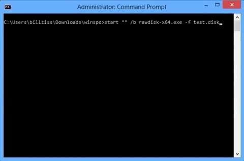
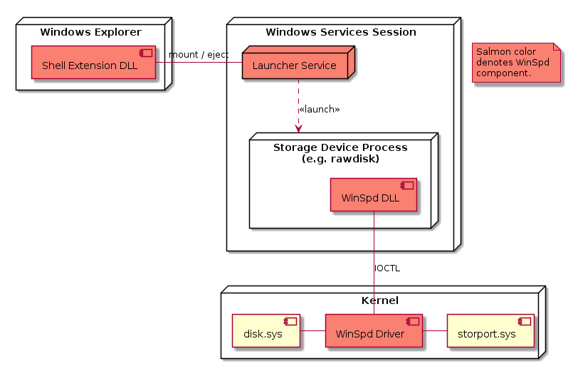

<h1 align="center">
    WinSpd &middot; Windows Storage Proxy Driver
</h1>

    <b>Download</b> 
    
     
     
    
     
     

    WinSpd enables the creation of storage units ("SCSI disks") in user mode (i.e. without writing any kernel mode code). Such storage units are created and served by user mode storage devices (i.e. user mode processes) and are added to the Windows OS storage stack. They appear to Windows as real disks that can be formatted and accessed via a file system such as NTFS.
     
     
    

## User Mode Storage Devices

A user mode storage device is a user mode process that can create and serve storage units. As storage unit is a SCSI "direct-access block device" (as per the definition in the SCSI SBC standard) or more commonly referred to as a "SCSI disk". It is used to store data in logical blocks; each block contains the same amount of data (the Block Length) and has a Logical Block Address (LBA), which is a 64-bit number in a single contiguous address space. In particular WinSpd (and the SCSI standard) do not assume the traditional geometry of cylinder-head-sector (CHS) for how blocks are laid out.

Storage units support two primary operations: read and write, and two secondary operations: flush and unmap:

- **Read**: read blocks at the specified LBA.
- **Write**: write blocks at the specified LBA.
- **Flush**: flush any cached block data at the specified LBA.
- **Unmap**: unmap (deallocate) blocks at the specified LBA. This is like the well known TRIM command.

For a full tutorial on creating a user mode storage device see the [Tutorial](doc/WinSpd-Tutorial.asciidoc).

## Design

WinSpd consists of a number of software components with different responsibilities:

- The core components are a kernel driver (implemented as a StorPort virtual miniport) and a user
  mode DLL. User mode storage devices use the DLL to communicate with the driver via special
  IOCTL's.
- A launcher service that is used to launch and control user mode storage devices.
- A shell extension that is used to implement the "mount" and "eject" functionalities available via
  the Windows Explorer and Shell.

The WinSpd virtual miniport implements the following SCSI commands:

- **REPORT LUNS**
- **TEST UNIT READY**
- **INQUIRY**: Standard, Supported Pages VPD, Serial Number VPD, Device Identifiers VPD, Block Limits VPD, Logical Block Provisioning VPD
- **MODE SENSE(6), MODE SENSE(10)**: All Pages, Mode Caching Page
- **READ CAPACITY(10), READ CAPACITY(16)**
- **READ(6), READ(10), READ(12), READ(16)**
- **WRITE(6), WRITE(10), WRITE(12), WRITE(16)**
- **SYNCHRONIZE CACHE(10), SYNCHRONIZE CACHE(16)**
- **UNMAP**

## Project Organization

The project source code is organized as follows:

* :file_folder: [build/VStudio](build/VStudio): WinSpd solution and project files.
* :file_folder: [ext](ext): External dependencies.
    * :file_folder: [ext/tlib](ext/tlib): A small test library originally from the secfs (Secure Cloud File System) project.
* :file_folder: [inc](inc): Public headers.
    * :file_folder: [inc/winspd](inc/winspd): Public headers for the WinSpd API.
* :file_folder: [src](src): WinSpd source code.
    * :file_folder: [src/devsetup](src/devsetup): Source code to the devsetup utility. It is used
      to add or remove the WinSpd device driver from the system.
    * :file_folder: [src/dll](src/dll): Source code to the WinSpd DLL. It is used by user mode
      storage devices to communicate with the WinSpd device driver.
    * :file_folder: [src/dotnet](src/dotnet): Source code to the .NET layer.
    * :file_folder: [src/launcher](src/launcher): Source code to the launcher service and the
      launchctl utility. The launcher service is used to launch and control user mode storage devices.
    * :file_folder: [src/scsitool](src/scsitool): Source code to the scsitool command line utility.
    * :file_folder: [src/shellex](src/shellex): Source code to the WinSpd shell extension. It is
      used to implement the "mount" and "eject" functionalities available via the Windows Explorer
      and the Shell.
    * :file_folder: [src/stgtest](src/stgtest): Source code to the stgtest storage testing tool.
    * :file_folder: [src/sys](src/sys): Source code to the WinSpd kernel driver.
* :file_folder: [tst](tst): Source code to example user mode storage devices and test tools.
* :file_folder: [tools](tools): Various tools for building and testing WinSpd.

## License

WinSpd is available under the [GPLv3](License.txt) license with a special exception for Free/Libre and Open Source Software. A commercial license is also available. Please contact Bill Zissimopoulos \<billziss at navimatics.com> for more details.
